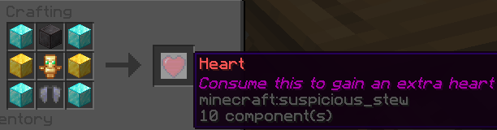

# AddHearts
Edible hearts that adds 1 heart to your maximum heart count with 4 diamond blocks, 2 gold blocks, 1 netherite block, 1 elytra and 1 totem of undying. Original idea from the Bukkit Forums: https://bukkit.org/threads/heart-recipe.494704/

# Recipe

# Commands
All of these require players to have the permission to use them.
/heart <add|remove> (player) - adds or removes hearts of the player specified
/heart reload - reloads the configuration and the recipe
# Permissions
- heart.use - allows players to eat hearts, but they can still craft them
- heart.add - for admins, adds hearts to the player specified by 1
- heart.remove - for admins, removes hearts from the player specified by 1

Made for Minecraft version 1.18. Tested on 1.21. Not tested on other versions.
